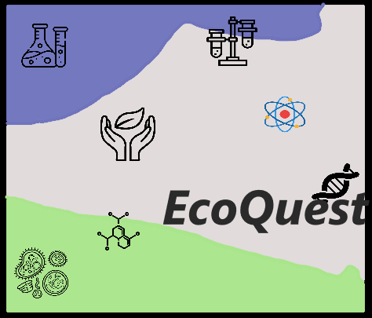

<h1>Team The test tube</h1>

  

 

## 📝 Table of contents

- [Description](#description)
- [Technologies](#technologies)
- [Documents](#documents)
- [Contributors](#contributors)
- [Download](#download)

## 💻 Description 

  

Our task was to relate the game to chemistry and biology. We tried to do that as much as possible. In our game you will see how chemistry, biology and ecology are involved, there are several mini games from the start menu you can choose your game.

## ⚒️ Technologies 

- [Visual Studio](https://visualstudio.microsoft.com/) - Application 
- [Word](https://www.microsoft.com/en-us/microsoft-365/word) - Documentation
- [PowerPoint](https://www.microsoft.com/en-us/microsoft-365/powerpoint) - Presentation
- [Excel](https://www.microsoft.com/en-us/microsoft-365/excel) - QA Documentation
- [Teams](https://teams.microsoft.com/) - Communication

## 📄 Documents 

- Documentation
- Presentation
- Test Plan
- Game Testing

## 🧑🏻‍💻 Contributors 

- <a href = "https://github.com/RAAleksandrov21"> Radomir Aleksandrov </a> (Scrum Trainer)
-   <a href = "https://github.com/SZGeorgiev21"> Stilian Georgiev </a> (Front-end Developer)
- <a href = "https://github.com/EEMustafa21"> Enis Mustafa </a> (Back-end Developer)
-  <a href = "https://github.com/SSPopov21"> Stanimir Popov </a> (QA Engineer)

## 📥 Download 

To download our project on your machine you just need to clone it. This can be done by pasting this text in your command prompt:

<pre>git clone https://github.com/RAAleksandrov21/The-test-tubes.git</pre>
